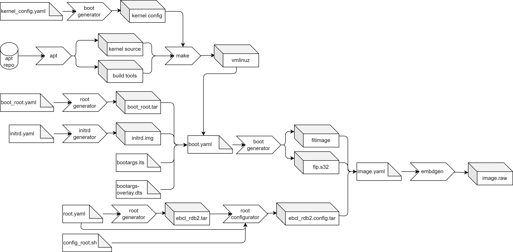

# Kernel development

If you do the bring-up for a new board, you may need to adapt the kernel configuration.
This section continues where "Building an image from scratch" ended.

Please be aware that EB corbos Linux allows you to “open the box”, but if you modify the provided binary packages the support and maintenance for these packages is not covered with the base offer.
You can get support, qualification and long term maintenance as an add-on to the base offer, as a yearly fee for each package.

Nevertheless, let’s see how we can build our own kernel.
To build a custom kernel package we need the kernel sources and the base kernel config.
We can get the kernel sources and build dependencies using apt:

```bash
mkdir -p kernel
cd kernel
apt -y source linux-buildinfo-5.15.0-1034-s32-eb
sudo apt -y build-dep linux-buildinfo-5.15.0-1034-s32-eb
```

For extracting the kernel config, we can again make use of the _boot generator_:

```yaml
# Derive values from base.yaml - relative path
base: base.yaml
# Do not pack the files as tar
tar: false
# download and extract the kernel package incl. depends
use_packages: true
# Files to copy to the build folder
files:
  - boot/config*
```

We can copy this config as _.config_ into the kernel source and build the kernel using make.

To make use of our local built kernel binary we need and adapted _boot.yaml_:

```yaml
# Derive values from base.yaml - relative path
base: base.yaml
# Reset the kernel value - we don't want to download and extract it
kernel: null
# Do not pack the files as tar
tar: false
# do not download and extract these packages, they are already installed in the boot_root.tar
use_packages: false
# Name of the boot root archive
base_tarball: $$RESULTS$$/boot_root.tar
# Files to copy form the host environment
host_files:
  - source: ../bootargs-overlay.dts
    destination: boot
  - source: ../bootargs.its
    destination: boot
  - source: $$RESULTS$$/initrd.img
    destination: boot
  - source: $$RESULTS$$/vmlinuz
    destination: boot
# Scripts to build the fitimage and fip.s32
scripts:
  - name: ../build_fitimage.sh # Build the fitimage in the boot_root.tar environment
    env: chroot
# Files to copy to the build folder
files:
  - boot/fip.s32
  - boot/fitimage
```

The only change compared to the old _boot.yaml_ is that we add ``$$RESULTS$$/vmlinuz`` to the _host_files_. This means our kernel binary is copied to the _/boot_ folder of the fitimage build environment, and will overwrite the one from the kernel Debian package.
This will give us the following build flow:



We can add this to our _Makefile_ with the following changes:

```make
#---------------------
# Image specifications
#---------------------

# Specification how to get the kernel config
kernel_config = kernel_config.yaml
# Kernel source package name
kernel_package = linux-buildinfo-5.15.0-1034-s32-eb

#--------------------
# Generated artifacts
#--------------------

# Kernel image
kernel = $(result_folder)/vmlinuz
# Kernel modules
modules = $(result_folder)/lib
# Kernel config
kconfig = $(result_folder)/config
# Kernel source
source = kernel
# Path of the kernel sources
kernel_dir = $(source)/linux-s32-eb-5.15.0
# Kernel make arguments
kernel_make_args = ARCH=arm64 CROSS_COMPILE=aarch64-linux-gnu-

#--------------------------
# Image build configuration
#--------------------------

# Download the kernel source form the apt repo
# and install the build dependencies.
$(source):
    @echo "Get kernel sources..."
    mkdir -p $(source)
    cd $(source) && apt -y source $(kernel_package)
    sudo apt -y build-dep $(kernel_package)
    cd $(kernel_dir) && chmod +x scripts/*.sh

# Get the kernel config from the configured kernel binary package.
$(kconfig): $(kernel_config) $(source)
    @echo "Get kernel config..."
    mkdir -p $(result_folder)
    set -o pipefail && boot_generator $(kernel_config) $(result_folder) 2>&1 | tee $(kconfig).log
    @echo "Renaming $(result_folder)/config-* as $(kconfig)..."
    mv $(result_folder)/config-* $(kconfig)
    @echo "Copying $(kconfig) to $(kernel_dir)..."
    cp $(result_folder)/config $(kernel_dir)/.config
    @echo "Set all not defined values of the kernel config to defaults..."
    cd $(kernel_dir) && $(MAKE) $(kernel_make_args) olddefconfig
    @echo "Copying modified config as olddefconfig..."
    cp $(kernel_dir)/.config $(result_folder)/olddefconfig

# Build the kernel binary
$(kernel): $(kconfig) $(source)
    @echo "Compile kernel..."
    cd $(kernel_dir) && $(MAKE) $(kernel_make_args) -j 16 Image
    @echo "Get kernel binary..."
    cp $(kernel_dir)/arch/arm64/boot/Image $(kernel)
    @echo "Results were written to $(kernel)"

# Adapt build spec for the fitimage
# Additional dependency to the kernel binary
# Please note that another boot_spec is used, see boot.yaml.
$(fitimage): $(boot_spec) $(boot_root) $(build_fitimage) $(fitimage_config) $(fitimage_config) $(initrd_img) $(kernel)
    @echo "Build $(fitimage)..."
    mkdir -p $(result_folder)
    set -o pipefail && boot_generator $(boot_spec) $(result_folder) 2>&1 | tee $(fitimage).log

# Make the modules and install them in the results folder
$(modules): $(kernel)
    @echo "Get virtio driver..."
    cd $(kernel_dir) && $(MAKE) $(kernel_make_args) modules -j 16
    cd $(kernel_dir) && chmod +x debian/scripts/sign-module
    mkdir -p $(result_folder)
    cd $(kernel_dir) && INSTALL_MOD_PATH=../../$(result_folder) $(MAKE) $(kernel_make_args) modules_install

#--------------------
# Helper make targets
#--------------------

# Configure the kernel binary
.PHONY: config_kernel
config_kernel:
    cd $(kernel_dir) && $(MAKE) $(kernel_make_args) menuconfig

# Rebuild the kernel binary
.PHONY: rebuild_kernel
rebuild_kernel:
    mkdir -p $(result_folder)
    cd $(kernel_dir) && $(MAKE) $(kernel_make_args) -j 16 Image
    @echo "Delete the old kernel binary..."
    rm -f $(kernel)
    @echo "Get the new kernel binary..."
    cp $(kernel_dir)/arch/arm64/boot/Image $(kernel)

# Rebuild the kernel modules
.PHONY: rebuild_modules 
rebuild_modules: kernel
    mkdir -p $(result_folder)
    cd $(kernel_dir) && $(MAKE) $(kernel_make_args) modules -j 16
    cd $(kernel_dir) && chmod +x debian/scripts/sign-module
    @echo "Delete the old kernel modules..."
    rm -rf $(modules)
    @echo "Install the new kernel modules..."
    cd $(kernel_dir) && INSTALL_MOD_PATH=../../$(result_folder) $(MAKE) $(kernel_make_args) modules_install

# clean - delete the generated artifacts
.PHONY: clean
clean:
    rm -rf $(source)
    rm -rf $(result_folder)
```

