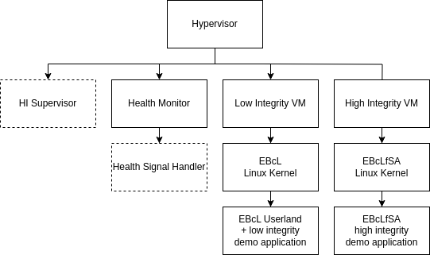
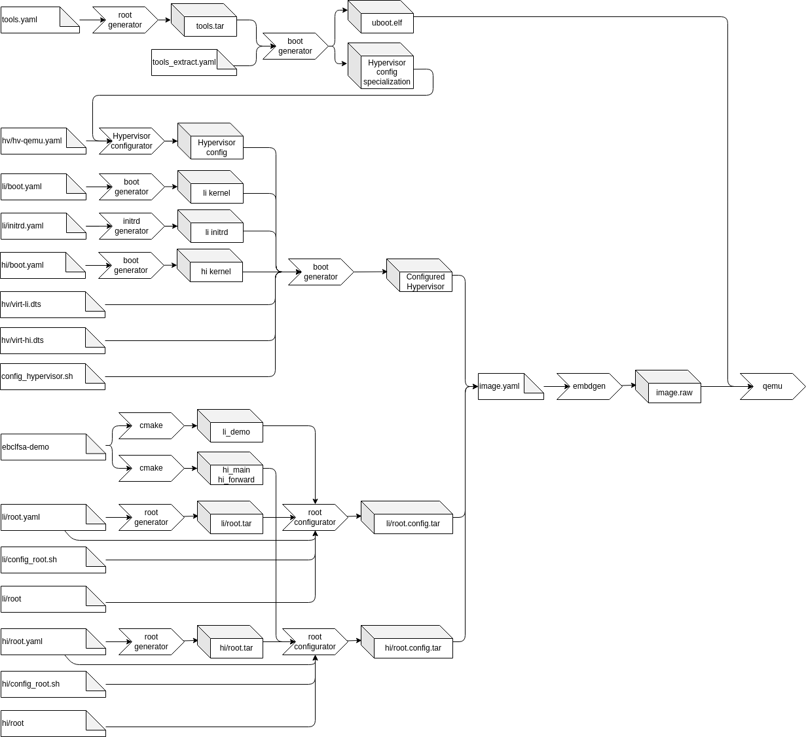

# The EB corbos Linux for Safety Applications image

This image (located in *images/arm64/qemu/ebclfsa*) is an example for a typical EBcLfSA image.
It generates an image with the EB corbos Hypervisor running two virtual machines.

One virtual machine (*li-vm*) is the low integrity VM.
This VM is a standard EB corbos Linux using crinit and elos.
It can be used just like any other EB corbos Linux image.

The second virtual machine (*hi-vm*) is the high integrity VM.
In a production release applications and the Linux kernel running in this VM are supervised by a component in the hypervisor (*HI Supervisor*).
The supervisor is not part of the free download version.
But as long as nothing unexpected happens (e.g. misbehavior of the Linux kernel), it is unlikely that the presence of the supervisor can be noticed.
The most noticeable impact of the supervisor is the limitation of allowed syscalls.
This however is implemented in the Linux kernel itself in a way, that prints a message to the console, when a prohibited syscall is executed.
Note that the list of allowed syscalls is subject to change rapidly during the ongoing development.

This high integrity partition only starts the initial high integrity application, there is no init process (like crinit or systemd) at the moment.
In the future this is also subject to change.

Another component running in the hypervisor is the Health Monitor.
This component implements a watchdog that is periodically triggered by the high integrity application.
In a production environment there would also be a Health Signal Handler that can implement a reaction to missing health indication (e.g. toggle a GPIO pin).

For communication between the low and high integrity applications and between high integrity applications there are shared memory segments provided by the hypervisor.
These shared memory segments are called "proxycom" and "hicom" for communication between high and low integrity and between high integrity respectively.
The demo application provides an example how to use these shared memory segments for communication.

For the included applications see: [EBcLfSA Demo Application](../apps/ebclfsa_demo.md).

## How to build and run

1. Unpack the hypervisor archive you received into the folder *results/packages*
2. Open a terminal in vscode (View -> Terminal -> New Terminal, select "workspace")
3. In the terminal enter `gen_sign_key && GNUPGHOME=/workspace/gpg-keys/.gnupg gen_app_apt_repo && serve_packages` (If this was executed already previously, it will ask if the files *Release.gpg* and *InRelease* should be overwritten. This has to be confirmed with `y`).
   This creates an apt repository and serves the packages on *http://localhost:8000*.
4. Navigate to *images/arm64/qemu/ebclfsa* in the explorer view, right click on ebclfsa and select "Open in Integrated Terminal"
5. In the new terminal run `make -j8 qemu`. This will build the image and run it in qemu.
6. Refer to the [EBcLfSA Demo Application](../apps/ebclfsa_demo.md) documentation for further information.

## Buildprocess

Building the image for ebclfsa uses the same tools as other images and additionally the hypervisor configurator and the demo application.
The main differences are:

 * It builds two root file systems, one for the high and one for the low integrity virtual machine
 * It configures the hypervisor to start the two virtual machines
 * It builds and includes the EBcLfSA demo application

The whole process is depicted in the image below

This documentation will only describe the configuration of the hypervisor.

### Hypervisor configuration

#### Step 1: Extract the hypervisor specialization

As described in the hypervisor config tool description, the tool allows specialization of the configuration model.
In the first step a tools root filesystem is generated.
The unconfigured hypervisor and the config specialization are installed in this filesystem.
At the end of this step the configuration specialization and u-boot used to boot the image are extracted.

#### Step 2: Generate the hypervisor configuration

In this step the extracted specialization is used together with the configuration yaml file (_hv/hv-qemu.yaml_) to generate all configuration files.

Parallel to this generation, the linux kernels for the high and low integrity VM are extracted and the initrd for the low integrity VM is generated.

#### Step 3: Build the final hypervisor

For this step several files are copied into the generated tools filesystem in order to generate the final hypervisor binary.
These files are:

 * The generated configuration
 * The extracted kernels
 * The initrd for the low integrity VM
 * The device tree sources for the high and low integrity VM

These files are then processed by _config_hypervisor.sh_ inside of the tools root filesystem.
First the two device trees are compiled using linux's device tree compiler, then the configured hypervisor is generated.

At the end of this step the configured hypervisor is extracted from the tools filesystem, so it can be installed onto the boot partition by embdgen.
