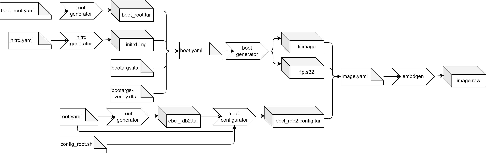

# Building an image from scratch

Let’s develop a new EB corbos Linux image step by step, for the NXP RDB2 board using the NXP S32G2 SoC.
According to the NXP S32G2 user manual, the following bootloader layout is required:

> The space between 0x0 and 0x1d_3000 is occupied by some or all of the following components: IVT, QSPI Parameters, DCD, HSE_FW, SYS_IMG, Application Boot Code Header, TF-A FIP image.
The actual layout is determined at boot time and can be obtained from the arm-trusted-firmware.
>
> IVT: Offset: 0x1000 Size: 0x100
> AppBootCode Header: Offset: 0x1200 Size: 0x40 
> U-Boot/FIP: Offset: 0x1240 Size: 0x3d400 
> U-Boot Environment: Offset: 0x1e0000 Size: 0x2000 
> 
> For SD/eMMC the partitioned space begins at 0x1d_3000.

For our SD card image, this means, the first 256B of the FIP image containing the ATF and the U-Boot needs to be written to block 0, then a gap of 0x2000 B is required, at position 0x1e0000 B, for the U-Boot env, and then the remaining part of the ATF and U-Boot image can be written.
The partition table and partitions come afterwards.

Further the user manual describes that the kernel can be provided as a FIT image, and one way to provide this FIT image is to put it on the first partition, which has to be FAT32, using the name _fitimage_.

All these requirements can be fulfilled with the following [embdgen](https://github.com/Elektrobit/embdgen) image description:

```yaml
# Partition layout of the image
# For more details see https://elektrobit.github.io/embdgen/index.html
image:
  type: mbr
  boot_partition: boot

  parts:
    - name: u-boot part 1
      type: raw
      start: 0
      size:  256 B
      content:
        type:  raw
        file:  out/fip.s32
  
    - name: u-boot part 2
      type: raw
      start:  512 B
      content:
        type:   raw
        file:   out/fip.s32
        offset: 512 B

    - name: uboot.env
      type:  empty
      start: 0x1e0000 B
      size:  0x2000 B

    - name: boot
      type: partition
      fstype: fat32
      content:
        type: fat32
        content:
          type: files
          files:
            - out/fitimage
      size: 100 MB

    - name: root
      type: partition
      fstype: ext4
      size: 2 GB
      content:
        type: ext4
        content:
          type: archive
          archive: out/ebcl_rdb2.config.tar
```

You may notice that this image description requires three artifacts:

- **fip.s32**: This is the binary image containing the arm trusted firmware (ATF) and the U-Boot bootloader.

- **fitimage**: This is the binary flattened image tree (FIT) containing the kernel and device tree.

- **ebcl_rdb2.config.tar**: This is a tarball containing the contents of our Linux root filesystem.

Since the NXP S32G2 SoC is supported by EB corbos Linux, a FIP image and a kernel binary is provided as part of the releases and free download.
The fip.s32 image is contained in the Debian package _arm-trusted-firmware-s32g_, and provided on https://linux.elektrobit.com/eb-corbos-linux/1.2 as part of the distribution _ebcl_nxp_public_ in the component _nxp_public_. The kernel binary and modules are provided by the same distro and component, packaged as _linux-image-unsigned-5.15.0-1023-s32-eb_, _linux-modules-5.15.0-1023-s32-eb_ and _linux-modules-extra-5.15.0-1023-s32-eb_. 

The tooling to build the fitimage is contained in the packages _u-boot-s32-tools_, _arm-trusted-firmware-s32g_, _device-tree-compiler_, and  _nautilos-uboot-tools_. We need to install these tools in some environment to be able to build the fitimage.
Adding them to the root filesystem would be a possibility, but not a good one, since this would bloat the root filesystem and also gives very useful tools to an attacker trying to hack our embedded solution.
Since the tooling is only needed during build time, a better approach is to install it in a separate environment.
This could be our build host, but since we want reproducible builds, the better solution is to use the _root generator_ to define and create a well specified chroot build environment.

Let’s first define some common settings used by our image overall, as _base.yaml_:

```yaml
# Kernel package to use
kernel: linux-image-unsigned-5.15.0-1023-s32-eb
# CPU architecture
arch: arm64
# Add the EB corbos Linux apt repo
use_ebcl_apt: true
# Add repo with NXP RDB2 packages
apt_repos:
  - apt_repo: http://linux.elektrobit.com/eb-corbos-linux/1.2
    distro: ebcl_nxp_public
    components:
      - nxp_public
    key: file:///build/keys/elektrobit.pub
    gpg: /etc/berrymill/keyrings.d/elektrobit.gpg

```

This _base.yaml_ states that we want to use the kernel package _linux-image-unsigned-5.15.0-1023-s32-eb_, build an arm64 image, and make use of the default EBcL apt repository, and the EBcL NXP additions.
Now we can base on this file and define our fitimage build environment as _boot_root.yaml_:

```yaml
# Derive values from base.yaml - relative path
base: base.yaml
# Name of the boot root archive
name: boot_root
# Packages for boot_root.tar
packages:
  - linux-image-unsigned-5.15.0-1023-s32-eb
  - linux-modules-5.15.0-1023-s32-eb
  - linux-modules-extra-5.15.0-1023-s32-eb
  - u-boot-s32-tools
  - arm-trusted-firmware-s32g
  - device-tree-compiler
  - nautilos-uboot-tools
```

We install all the above mentioned packages into this environment.
For building the fitimage, and for extracting the fip.s32, we can make use of the _boot generator_:

```yaml
# Derive values from base.yaml - relative path
base: base.yaml
# Reset the kernel value - we don't want to download and extract it
kernel: null
# Do not pack the files as tar
tar: false
# do not download and extract these packages, they are already installed in the boot_root.tar
use_packages: false
# Name of the boot root archive
base_tarball: $$RESULTS$$/boot_root.tar
# Files to copy form the host environment
host_files:
  - source: bootargs-overlay.dts
    destination: boot
  - source: bootargs.its
    destination: boot
  - source: $$RESULTS$$/initrd.img
    destination: boot
    base_dir: .
# Scripts to build the fitimage and fip.s32
scripts:
  - name: build_fitimage.sh # Build the fitimage in the boot_root.tar environment
    env: chroot
# Files to copy to the build folder
files:
  - boot/fip.s32
  - boot/fitimage
```

The kernel is already part of the chroot tarball environment, and we don’t need to download it again.
We need to provide the fitimage and fip.s32 binaries directly to embdgen, so we don’t want to pack it.
The tarball created by the root generator will be named “boot_root.tar”, because of the name given in the _boot_root.yaml_. Because of the “base_tarball” parameter, the _boot generator_ will pick up the tarball, extract it and chroot into this environment.
The _boot generator_ will also replace the string ``$$RESULTS$$`` with the path to the given output folder.
In addition, we need the files “bootargs-overlay.dts”, “bootargs.its” and ``$$RESULTS$$/initrd.img`` in the host environment.
These files will be copied into the chroot environment and used for building the fitimage.
The script _build_fitimage.sh_ implements the fitimage building.
When this script has done its job, the files _fip.s32_ and _fitimage_ will be copied to the output folder.

To use this recipe, we first need the input artifacts.
The _bootargs.its_ is the fitimage description we need to provide.
The following description will do the job:

```dts
/dts-v1/;
/ {
  description = "BaseOS Boot Image";
  #address-cells = <1>;
  images {
    kernel-1 {
      description = "Linux kernel image";
      data = /incbin/("Image");
      type = "kernel";
      arch = "arm64";
      os = "linux";
      compression = "none";
      load = <0x80000000>;
      entry = <0x80000000>;
      hash-1 { algo = "md5"; };
    };
    fdt-1 {
      description = "Flattened device tree blob";
      data = /incbin/("target.dtb");
      type = "flat_dt";
      arch = "arm64";
      compression = "none";
      hash-1 { algo = "md5"; };
    };
    ramdisk-1 {
      description = "Initial ramdisk image";
      data = /incbin/("initrd");
      type = "ramdisk";
      arch = "arm64";
      os = "linux";
      compression = "gzip";
      load =  <0x90000000>;
      entry = <0x90000000>;
      hash-1 { algo = "md5"; };
    };
  };
  configurations {
    default = "config-1";
    config-1 {
      description = "Default boot config";
      kernel = "kernel-1";
      ramdisk = "ramdisk-1";
      fdt = "fdt-1";
    };
  };
};
```

It describes a fitimage consisting of a kernel binary, a device tree and an initrd.img.

The _bootargs-overlay.dts_ is the U-Boot configuration:

```dts
/dts-v1/;
/plugin/;

&{/chosen} {
    bootargs = "console=ttyLF0,115200 earlycon nohz=off coherent_pool=64M root=/dev/mmcblk0p2 selinux=0 rw";
};
```

The _initrd.img_ is the initial ramdisk we want to use.
We can use the _initrd generator_ to create such an _initrd.img_ which fits our needs.
As long as we don’t want to implement secure boot, your needs are quite small.
We just want to use _/dev/mmcblk0p2_ as root partition, which is partition two of the internal eMMC storage.

```yaml
# Derive values from base.yaml - relative path
base: base.yaml
# Reset the kernel value - we don't want to download and extract it
kernel: null
# Root device to mount
root_device: /dev/mmcblk0p2
```

Running the _initrd generator_ with this spec will create us a minimal initrd.img.

The final missing input is the script to generate the fitimage.
We can use the following script:

```bash
#!/bin/sh

set -e

#======================
# Get NXP S32G ATF (secure boot image)
#---------------------------------------
cp /usr/lib/arm-trusted-firmware-s32g/s32g274ardb2/fip.s32 \
    /boot/fip.s32

#======================
# Rename kernel
#---------------------------------------
echo "Rename kernel..."
if [ ! -f /boot/vmlinuz ]; then
    mv /boot/vmlinuz-* /boot/Image
fi
mv /boot/vmlinuz /boot/Image
mv /boot/initrd.img /boot/initrd

#======================
# Get NXP S32G device tree
#---------------------------------------
cp /lib/firmware/*/device-tree/freescale/s32g274a-rdb2.dtb \
    /boot/fsl-s32g274a-rdb2.dtb

#======================
# Create fit image
#---------------------------------------
cd /boot

dtc -I dts -O dtb -o bootargs-overlay.dtbo bootargs-overlay.dts

fdtoverlay -i fsl-s32g274a-rdb2.dtb -o target.dtb bootargs-overlay.dtbo
ls -lah bootargs-overlay.dtbo

mkimage -f bootargs.its fitimage
```

Now we are prepared to build our fitimage, and get the fip.s32 binary.


We can build the _boot_root.tar_ using the command `root_generator boot_root.yaml ./out`, then we can build the _initrd.img_ using the command `initrd_generator initrd.yaml ./out`, and finally we can build the _fitimage_ using the command `boot_generator boot.yaml ./out`.

To avoid typing all these commands by hand, we can use make.
The following _Makefile_ will do the job:

```make
#--------------
# Result folder
#--------------

result_folder ?= ./out

#---------------------
# Select bash as shell
#---------------------

SHELL := /bin/bash

#---------------------
# Image specifications
#---------------------

partition_layout ?= image.yaml

initrd_spec ?= initrd.yaml
boot_root_spec ?= boot_root.yaml
boot_spec ?= boot.yaml

#-------------------------
# Additional configuration
#-------------------------

# Build script for the fitimage
build_fitimage ?= build_fitimage.sh

# Layout of the fitimage
fitimage_config ?= bootargs.its

# NXP bootloader config
bootloader_config ?= bootargs-overlay.dts

#--------------------
# Generated artifacts
#--------------------

# Disc image
disc_image ?= $(result_folder)/image.raw

# Boot root tarball
boot_root ?= $(result_folder)/boot_root.tar

# Disc image
fitimage ?= $(result_folder)/fitimage

# Generated initrd.img
initrd_img ?= $(result_folder)/initrd.img

#--------------------------
# Image build configuration
#--------------------------

# The initrd image is built using the initrd generator.
# initrd_spec: specification of the initrd image.
$(initrd_img): $(initrd_spec)
	@echo "Build initrd.img..."
	mkdir -p $(result_folder)
	set -o pipefail && initrd_generator $(initrd_spec) $(result_folder) 2>&1 | tee $(initrd_img).log

# The root generator is used to build a sysroot variant of the root filesystem.
# root_filesystem_spec: specification of the root filesystem
#
# --no-config means that the configuration step is skipped
$(sysroot_tarball): $(root_filesystem_spec)
	@echo "Build sysroot.tar..."
	mkdir -p $(result_folder)
	set -o pipefail && root_generator --sysroot --no-config $(root_filesystem_spec) $(result_folder) 2>&1 | tee $(sysroot_tarball).log


# The root generator is used to build a chroot environment which contains all tools for building the fitimage.
# boot_root_spec: specification of the fitimage build environment
$(boot_root): $(boot_root_spec)
	@echo "Build $(boot_root) from $(boot_root_spec)..."
	mkdir -p $(result_folder)
	set -o pipefail && root_generator --no-config $(boot_root_spec) $(result_folder) 2>&1 | tee $(boot_root).log

# The boot generator is used to run the fitimage build in a chroot environment.
# boot_spec: spec of the fitimage build environment
# boot_root: tarball of the fitimage build environment
# build_fitimage: build script for the fitimage
# fitimage_config: fitimage layout configuration
# fitimage_config: bootloader configuration
# initrd_img: the initrd.img which is embedded in the fitimage
# initrd_spec: the initrd.img specification
$(fitimage): $(boot_spec) $(boot_root) $(build_fitimage) $(fitimage_config) $(fitimage_config) $(initrd_img)
	@echo "Build $(fitimage)..."
	mkdir -p $(result_folder)
	set -o pipefail && boot_generator $(boot_spec) $(result_folder) 2>&1 | tee $(fitimage).log

#--------------------------------
# Default make targets for images
#--------------------------------

# build of the initrd.img(s)
.PHONY: initrd
initrd: $(initrd_img)

# build of the fitimage
.PHONY: boot
boot: $(fitimage)

# build of the fitimage build env
.PHONY: boot_root
boot_root: $(boot_root)

# clean - delete the generated artifacts
.PHONY: clean
clean:
	rm -rf $(result_folder)
```

Now the board specific parts are done, and the only missing piece to build the image is the root filesystem.
A minimal root filesystem making use of the _systemd_ init manager can be specified as: 

```yaml
base: base.yaml
name: ebcl_rdb2
type: debootstrap
packages:
  - systemd
  - udev
  - util-linux
# Scripts to configure the root tarball
scripts:
  - name: config_root.sh # Name of the script, relative path to this file
    env: fake
```

The _config_root.sh_ script is needed to link _systemd_ as _/sbin/init_.

```bash
#!/bin/sh

# Link systemd as init
ln -s /usr/lib/systemd/systemd ./sbin/init
```

To build the root filesystem tarball, we can run `root_generator root.yaml ./out`, or we extend our _Makefile_.

```make
#---------------------
# Image specifications
#---------------------

# Specification of the root filesystem content and configuration
root_filesystem_spec ?= root.yaml

#-------------------------
# Additional configuration
#-------------------------

# Config script for root filesystem
config_root ?= config_root.sh

#--------------------
# Generated artifacts
#--------------------

# Base root tarball
base_tarball ?= $(result_folder)/ebcl_rdb2.tar

# Configured root tarball
root_tarball ?= $(result_folder)/ebcl_rdb2.config.tar

#--------------------------
# Image build configuration
#--------------------------

# The root generator is used to build the base root filesystem tarball.
# root_filesystem_spec: specification of the root filesystem packages.
#
# This first step only installs the specified packages.
User configuration
# is done as a second step, because the build of this tarball is quite 
# time consuming and configuration is fast.
This is an optimization for 
# the image development process.
$(base_tarball): $(root_filesystem_spec)
	@echo "Build root.tar..."
	mkdir -p $(result_folder)
	set -o pipefail && root_generator --no-config $(root_filesystem_spec) $(result_folder) 2>&1 | tee $(base_tarball).log

# The root configurator is used to run the user configuration scripts
# as a separate step in the build process.
# base_tarball: tarball which is configured
# config_root: the used configuration script
$(root_tarball): $(base_tarball) $(config_root)
	@echo "Configuring ${base_tarball} as ${root_tarball}..."
	mkdir -p $(result_folder)
	set -o pipefail && root_configurator $(root_filesystem_spec) $(base_tarball) $(root_tarball) 2>&1 | tee $(root_tarball).log
```

The above makefile splits the image installation and the configuration step of building the root tarball.
This is useful if you expect changes for the configuration, because the installation step is quite time consuming, and the configuration step is quite fast.
This optimization can save you a lot of build time.

Finally we need to run embdgen to build our binary image.
This can be done manually running `embdgen image.yaml ./out`, but we can also add it to our _Makefile_.

```make
#---------------------
# Image specifications
#---------------------

# Specification of the partition layout of the image.raw
partition_layout ?= image.yaml

#--------------------
# Generated artifacts
#--------------------

# Disc image
disc_image ?= $(result_folder)/image.raw

#--------------------------
# Image build configuration
#--------------------------

# Embdgen is used to build the SD card image.
# fitimage: the fitimage containing the kernel, the device tree and the initrd.img
# root_tarball: the contents of the root filesystem
# partition_layout: the partition layout of the SD card image
#
# The bootloader fip.s32 is not explicitly mentioned, since it is built in one step
# with the fitimage.
$(disc_image): $(fitimage) $(root_tarball) $(partition_layout)
	@echo "Build image..."
	mkdir -p $(result_folder)
	set -o pipefail && embdgen -o ./$(disc_image) $(partition_layout) 2>&1 | tee $(disc_image).log
```

Now you have an image which you can flash to your NXP RDB2 board.
The overall build flow with the changes above is:


