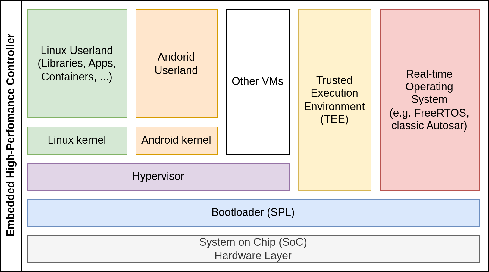

# Image concept

EB corbos Linux is designed to build embedded high-performance controllers. Such systems use typically quite powerful and complex arm64 SoCs, and involve hypervisors, real-time operating systems, trusted execution environments, and a non-trivial boot process involving secure boot. The requirements from the SoC and the bootloaders to the required eMMC storage layout is often complex and very different between different SoCs. To tackle this challenge, EB corbos Linux considers all the different boxes in the diagram above as separate build artifacts, which can be binary integrated into an overall image as the last build step. These build steps are organized using make, and the EB corbos Linux SDK provides small helper tools to create these artifacts. The integration, if needed, is done using [Embdgen](https://github.com/Elektrobit/embdgen), an Elektrobit-launched open-source tool, which is able to create binary images in various formats from different binary artifacts.

Let’s take a closer look at this for the very simple QEMU build target. Typically QEMU get a disc image, a Linux kernel binary and optionally an initrd.img, together with some configuration parameters.

From a run-time point of view, there are dependencies between these three artifacts caused by the used kernel version. The used kernel modules need to fit to the used kernel, and the C library used in the root filesystem must fit to the used kernel interface. From a build-time point of view, and also for our QEMU target point of view, these are three different artifacts. This has an important impact on the development process and workflow. If the initrd behavior shall change, only the initrd image needs to be rebuilt.

EB corbos Linux makes use of a set of small helper tools to support a flexible build flow and optimized build speed and development experience. These tools read yaml configuration files to specify the generated artifacts. To avoid redundant configuration, these configuration files support hierarchical includes. For the QEMU example the full build flow is:

