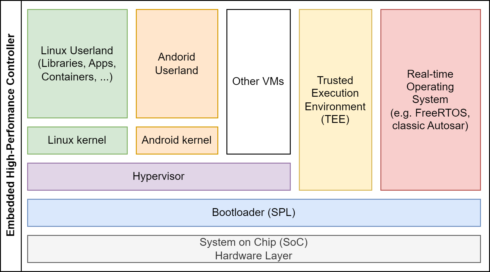
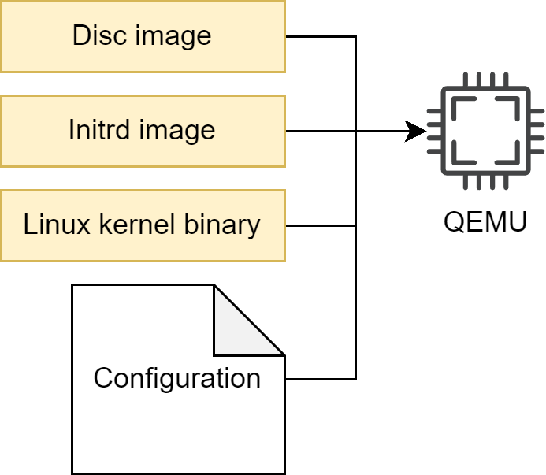

# Image concept

EB corbos Linux is designed to build embedded high-performance controllers.
Such systems typically use quite powerful and complex arm64 SoCs, and involve hypervisors, real-time operating systems, trusted execution environments, and a non-trivial boot process involving secure boot.
The requirements from the SoC and the bootloaders to the required eMMC storage layout is often complex and quite different between different SoCs.
To tackle this challenge, EB corbos Linux considers all the different boxes in the diagram above as separate build artifacts, which can be binary integrated into an overall image as the last build step.
These build steps are organized using make, and the EB corbos Linux SDK provides [small helper tools](https://github.com/Elektrobit/ebcl_build_tools/) to create these artifacts.
The integration, if needed, is done using [Embdgen](https://github.com/Elektrobit/embdgen), an Elektrobit-launched open-source tool, which is able to create binary images in various formats from different binary artifacts.

Let’s take a closer look at this build for the very simple QEMU build target.
Typically QEMU gets a disc image, a Linux kernel binary and optionally an initrd.img, together with some configuration parameters.

From a run-time point of view, there are dependencies between these three artifacts caused by the used kernel version.
The used kernel modules need to fit to the used kernel, and the C library used in the root filesystem must fit to the used kernel interface.
From a build-time point of view, and also for our QEMU target point of view, these are three different artifacts.
This has an important impact on the development process and workflow.
If the initrd behavior shall change, only the initrd image needs to be rebuilt.

EB corbos Linux makes use of a set of [small helper tools](https://github.com/Elektrobit/ebcl_build_tools/) to support a flexible build flow and optimized build speed and development experience.
These tools read yaml configuration files to specify the generated artifacts.
To avoid redundant configuration, these configuration files support hierarchical includes.
For the QEMU example the full build flow is:

The _image.yaml_ defines the storage layout, and is used as input for the [embdgen](https://github.com/Elektrobit/embdgen) integration step.
The _base.yaml_ contains the common configuration, like used apt repositories, and is included by the specifications of the different artifacts.
The _root.yaml_ describes the root filesystem of the Linux VM.
This file system is generated using debootstrap, installing additional required packages, and finally applying solution specific configuration, given as overlay files or scripts.
The debootstrap and package installation step is handled by the root generator.
This quite time-consuming step only needs to be repeated when the package selection is changed.
The root configurator applies the solution specific configuration.
The output of these two steps is a tarball of the root filesystem content.
[Embdgen](https://github.com/Elektrobit/embdgen) is used to convert this tarball into a disc image.
The _initrd.yaml_ specifies the content of the _initrd.img_. For QEMU, we need to load the virt-IO block driver, to be able to mount the root filesystem.
The _boot.yaml_ specifies the kernel which shall be used, and the boot generator is used to download the right Debian packages and extract the kernel binary.
The chaining of these tools is done using a good old makefile.
