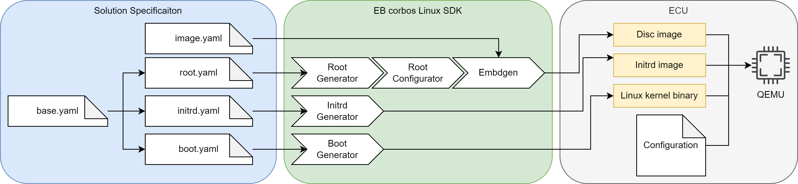

# Image specification

Let's take a look at this QEMU build flow example in detail and see how the details of this solution are specified and the roles of the different [build helper tools](https://github.com/Elektrobit/ebcl_build_tools/).



Let’s look at it from left to right.
The _base.yaml_ specifies the common aspects of all the generated artifacts.
It configures the kernel package, the used apt repositories and the target CPU architecture.

```yaml
# Kernel package to use
kernel: linux-generic
# Apt repositories to use
apt_repos:
  - apt_repo: http://ports.ubuntu.com/ubuntu-ports
    distro: jammy
    components:
      - main
      - universe
  - apt_repo: http://ports.ubuntu.com/ubuntu-ports
    distro: jammy-security
    components:
      - main
      - universe
# CPU architecture
arch: arm64
```

The boot.yaml builds on top of the base.yaml.
It specifies to download the dependencies of the used kernel package, which is necessary if a meta-package is used, and it specifies that the config* and vmlinuz* files from the boot folder shall be used as results.
The tar flag specifies that the results shall not be bundled as a tarball, but instead directly copied to the output folder.

```yaml
# Derive values from base.yaml - relative path
base: base.yaml
# Download dependencies of the kernel package - necessary if meta-package is specified
download_deps: true
# Files to copy from the packages
files:
  - boot/vmlinuz*
  - boot/config*
# Do not pack the files as tar - we need to provide the kernel binary to QEMU
tar: false

```

The _boot generator_ reads this configuration, and the _base.yaml_, downloads and extracts the package _linux-generic_ and its dependencies to a temporary folder, and copies the kernel binary and kernel configuration to the given output folder.
In general, the _boot generator_ is the tool to automate the build steps of the boot artifacts, like kernel collection and generation of SoC specific binary artifacts.

Let's now take a look at the _initrd.img_ generation.
The initrd images created by the tooling from the server and desktop world are very flexible and complete from a feature point of view, but completely bloated from an embedded point of view.
Since we know our target hardware and software in detail, we don’t need flexibility, but typically we want to have the best startup performance we can squeeze out of the used hardware.
The _initrd generator_ is a small helper tool to build a minimal _initrd.img_, to get the best possible startup performance.
It also helps to fast and easily customize the initrd content, e.g.
for implementing a secure boot solution.

```yaml
# Derive values from base.yaml - relative path
base: base.yaml
# Root device to mount
root_device: /dev/vda1
# List of kernel modules
modules:
  - kernel/drivers/block/virtio_blk.ko # virtio_blk is needed for QEMU
```

The initrd specification also derives the values from the _base.yaml_, and specifies that the _/dev/vda1_ shall be used as device for the root filesystem.
Since the Canonical default kernel has no built-in support for virt-IO block devices, we have to load this driver in the _initrd.img_, to be able to mount the root filesystem.
This is done by specifying the kernel module in the modules list.
Because of this line, the _initrd generator_ downloads and extracts the specified kernel package and its dependencies, detects the kernel version, gets the right module, adds it to the _initrd.img_, and loads it before mounting the root filesystem.
How this works in detail will be described in the later chapters.

```yaml
# Derive the base configuration
base: base.yaml
# Reset the kernel - should not be installed
kernel: null
# Name of the archive.
name: ubuntu
# Packages to install in the root tarball
packages:
  - systemd
  - udev        # udev will create the device node for ttyS0
  - util-linux
# Scripts to configure the root tarball
scripts:
  - name: config_root.sh # Name of the script, relative path to this file
    env: chroot # Type of execution environment

```

The last missing artifact is our root filesystem.
The _root.yaml_ describes the used root filesystem.
It doesn’t need to contain a kernel, since the kernel is provided separately to QEMU.
For Debian based distributions, a minimal set of required packages are specified by the used base distribution, in our case Ubuntu Jammy.
These packages are installed automatically, and we only need to specify what we want to have on top.
In this case, it is _systemd_ as init manager, _udev_ to create the device nodes, and _util-linux_ to provide the basic CLI tools.
In addition, a config script is specified which adapts the configuration to our needs.
This script is executed in a chroot environment.
The name is used as the name for the resulting tarball of the root filesystem.

The build flow is using the _root generator_ and the _root configurator_ to separate the installation and configuration steps.
The installation step takes much longer than the configuration step, and it only needs to be repeated when the package selection was adapted.
This separation allows a fast iterative configuration of the root filesystem.

The last step is to convert the configured root tarball into a disc image.
The storage layout is specified in the _image.yaml_, and is picked up by _embdgen_. For the QEMU image we use a simple gpt partition table based image with only one partition.
This partition is using the ext4 file format, has a size of 2 GB, and is filled with the contents of our root tarball.

```yaml
# Partition layout of the image
# For more details see https://elektrobit.github.io/embdgen/index.html
image:
  type: gpt
  boot_partition: root

  parts:
    - name: root
      type: partition
      fstype: ext4
      size: 2 GB
      content:
        type: ext4
        content:
          type: archive
          archive: build/ubuntu.config.tar
```

All together, we have a complete specification of our embedded solution, targeting QEMU as our virtual hardware.
