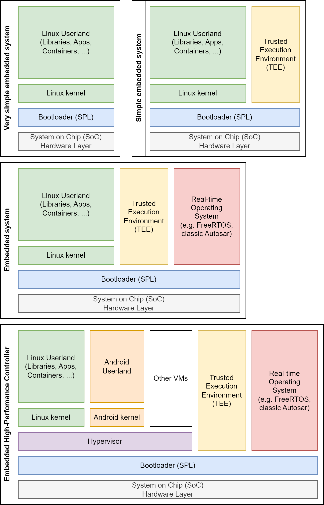

# Overview

EB corbos Linux built on Ubuntu is a long-term maintained embedded Linux distribution focused on automotive ECUs.
Elektrobit can provide security patches for a frozen package set for up to 15 years on quite low pricing.
To realize this, Elektrobit partners with Canonical.
EB corbos Linux uses many Ubuntu packages, qualifies these packages for automotive embedded use-cases in reference images, and adds additional embedded optimized components, to create an industry grade embedded Linux build toolkit.

In contrast to general purpose Linux distributions, EB corbos Linux allows a user to create a completely customer specific image from scratch in a reproducible way.
This is realized using this SDK.
A free variant of EB corbos Linux is available at the [Elektrobit homepage](https://www.elektrobit.com/products/ecu/eb-corbos/linux-built-on-ubuntu/). To kick-start the development of new ECUs, a full EB corbos Linux release also contains pre-qualified reference images which already implement typical automotive use-cases.
The free variant doesn't contain proprietary hardware drivers or pre-qualified reference images.
Please contact [Elektrobit sales](https://www.elektrobit.com/contact-us/) to get a full evaluation package of EB corbos Linux.

The image above shows a range of embedded system architectures.

Very simple embedded systems run only a bare-metal Linux.
An example for such a system is the Raspberry Pi running Raspberry Pi OS.
Such images can be easily directly generated with tools like [elbe](https://elbe-rfs.org/), [kiwi-ng](https://osinside.github.io/kiwi/) or [debos](https://github.com/go-debos/debos), but this architecture doesn’t fit industrial needs.

For real world industrial solutions at least secure boot is required, and typically a Trusted Execution Environment (TEE) is involved in the secure boot process.
This is depicted above as a simple embedded system.
Such images may already require a more complex partition layout, depending on the bootloader and SoC requirements.

In the automotive world, in addition to a Posix OS, typically also a safety certified realtime OS like classic Autosar is involved.
This is depicted above as an embedded system.
If this is combined with an A/B schema for the update of the Linux and the classic Autosar the storage layout gets quite complex and can hardly be directly created with the tools mentioned above.

Our day to day business at [Elektrobit](https://www.elektrobit.com/) are automotive high-performance controllers (HPCs). HPCs extend the embedded system architecture with a hypervisor and multiple virtual machines (VMs), like an additional Android VM for infotainment solutions.
The target of EB corbos Linux, and this SDK, is to fully support such embedded high-performance controller system architectures, and allow development and maintenance of such systems in an easy, efficient and reliable way.

[This repository](https://github.com/Elektrobit/ebcl_template/) provides a template workspace to start developing your own Linux images and applications.
It's based on a [dev container](https://github.com/Elektrobit/ebcl_dev_container) to provide a consistent build environment.
This dev container can also be used stand-alone with other IDEs or in CI environments.
For more details about the container and stand-alone usage look at the [dev container repository](https://github.com/Elektrobit/ebcl_dev_container).
