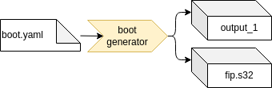

# Boot generator

An initrd can be generated with the initrd generator.

**boot_generator** — Built an initrd

## Description

Creates a custom initial RAM disk (initrd) based on busybox using YAML configuration file.
The synopsis is `boot_generator <boot>.yaml <output_path>`



The internal steps are:

 1. Read in YAML configuration file
 2. Download debian packages
 3. In a temporary folder
    1. Extract debian packages into the folder
    2. Copy all specified (host)files and directories into the folder
    3. Run config scripts in the folder
 4. Generate boot tarball from the temporary folder, if configured

## Configuration options

```yaml
# Derive values from base.yaml - relative path
base: <base.yaml>
kernel: as in base yaml, if build locally set to null
tar: <true|false>
use_packages:<true|false>
# Name of the boot root archive, if given will be used as initial tarball base
base_tarball: $$RESULTS$$/boot_root.tar
# Files to copy form the host environment
host_files:
  - source: <file>
    destination: <folder>
# Files to copy to the build folder
files:
  - <file_path>
# You can define multiple configuration scripts that will run "in" the tarball
scripts:
  - name: <name.sh>
    env: <chroot|chfake>
```
