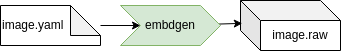

# Embdgen

Creates a disk image for embedded devices

**embdgen** — embedded disk generator.

## Description

Creates a disk images mainly for embedded devices. The configuration is given in a YAML file that gives a declarative image in a hierarchial way. It used to combine all artifacts from the previous build steps - for example a Disk image, Initrd and Kernel binary - together to the (final) image.
The synopsis is `embdgen <config>.yaml`

Please find the upstream documentation as well here: https://elektrobit.github.io/embdgen/index.html