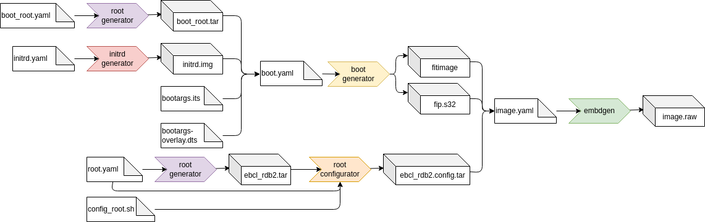

# The build tools

In below example of the build flow for the s32g you can see all currently supported tools marked in color.
An explanation of the flow is already given in the Section "Building an image from scratch".

The idea behind the set of build tools in this SDK follows the UNIX philosophy to make each program do one and only one thing well and  by adding new features through connecting the output from one program to another program that again does one job well.
This modular approach offers high flexibility and is easy to maintain.
