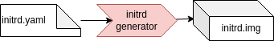

# Initrd generator

An initrd can be generated with the initrd generator.

**initrd_generator** — Built an initrd

## Description

Creates a custom initial RAM disk (initrd) based on busybox using YAML configuration file.
The synopsis is `initrd_generator <initrd>.yaml <output_path>`



The internal steps are:

 1. Read in YAML configuration file
 2. Add BusyBox binary
 3. Download and extract additional packages
 4. Add kernel modules, extracts the specified modules
 5. Creates device nodes for initrd image based on the configuration.
 6. Copy all specified files and directories into the initrd image
 7. Generate the init script
 8. Generate initrd based on all the files using `cpio`

## Configuration options

```yaml
# Derive values from base.yaml - relative path
base: <base.yaml>
# Download dependencies of the kernel package - necessary if meta-package is specified
download_deps: <true|false>
# Files to copy from the packages
files:
  - boot/vmlinuz*
  - boot/config*
# Do not pack the files as tar - we need to provide the kernel binary to QEMU
tar: false
# Add kernel modules
modules:
  - <path_to_module_1>
  - ...
modules_urls: [<module.deb>]
# Url to download the busybox from
# if none given busybox-static from mirrors defined in base.yaml will be used
busybox_url: '<url.deb>'
# If not using the kernel meta-package specify a concrete version
kversion: <version>
# Root device to mount
root_device: dev/<root_device>
# devices to be available in init, type can be block ot char
devices:
  - name: <name>
    type: <block|char>
    major: <major_number>
    minor: <minor_number>
  - ...
# Packages to add, e.g. e2fstools
packages:
  - <package name>
  - ...
```
